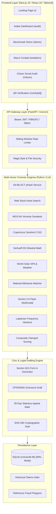

# 🏗️ PramanSetu System Architecture

```mermaid
graph TB
    subgraph ClientLayer["Frontend Layer (Next.js 15 / React 19 / Tailwind)"]
        UI_Home["Landing Page (/)"]
        UI_Audit["Intake Dashboard (/audit)"]
        UI_Demo["Benchmark Demo (/demo)"]
        UI_Analytics["Macro Cockpit (/analytics)"]
        UI_Citizen["Citizen Social Audit (/citizen)"]
        UI_Verify["QR Verification (/verify/[id])"]
    end

    subgraph GatewayLayer["API Gateway Layer (FastAPI / Uvicorn)"]
        AUTH["Bearer JWT / PBKDF2 / RBAC"]
        RATELIMIT["Sliding Window Rate Limiter"]
        VALIDATOR["Magic Byte & File Security"]
    end

    subgraph EngineLayer["Multi-Vector Forensic Engines (Python 3.14)"]
        V1["64-Bit DCT pHash Service"]
        V2["Web Stock Asset Search"]
        V3["WGS-84 Vincenty Geodesic"]
        V4["Copernicus Sentinel-2 GIS"]
        V5["Verhoeff D5 Dihedral Math"]
        V6["NOAA Solar SPA & Weather"]
        V7["Material Milestone Matcher"]
        V8["Gemini 2.0 Flash Multimodal"]
        V9["Laplacian Frequency Variance"]
        V10["Composite Clamped Scoring"]
    end

    subgraph LegalLayer["Civic & Legal Drafting Engine"]
        RTI_GEN["Section 6(1) Form A Generator"]
        CPGRAMS["CPGRAMS Grievance Draft"]
        COUNTDOWN["30-Day Statutory Appeal Math"]
        SEAL["SHA-256 Cryptographic Seal"]
    end

    subgraph StorageLayer["Persistence Layer"]
        SQLITE[("SQLite (civicaudit.db) [WAL Mode]")]
        MOCK_DB["Historical Claims Index"]
        GIS_ZONES["Reference Fraud Polygons"]
    end

    ClientLayer --> GatewayLayer
    GatewayLayer --> EngineLayer
    EngineLayer --> LegalLayer
    LegalLayer --> StorageLayer
```
